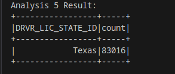
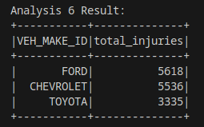
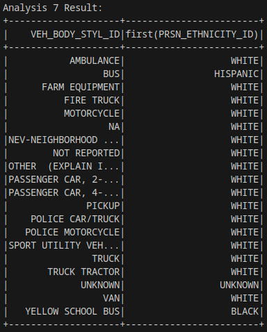
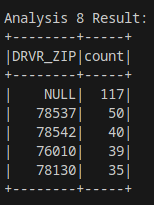
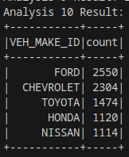

# BCG-Case-study

This case study is about car crashes across the US . I will be analysing the
metadata in detail to understand any information possible.

## Meta Data Analysis

With the given metadata, 
- for all the join operations , CRASH_ID is a key that can be used.
- Every dataset  given has  has 1048576 rows.
- There is no issue of datatypes mismatch with these datasets.
- All the datasets seem to be clean with no null values .

## Analytical solutions for the given questions

- Analysis 1: Find the number of crashes (accidents) in which number of persons killed are male? : **0**
- Analysis 2: How many two wheelers are booked for crashes? : **167456**
- Analysis 3: Determine the Top 5 Vehicle Makes of the cars present in the crashes in which driver died and Airbags did not deployed
  
  
  
- Analysis 4: Determine number of Vehicles with driver having valid licences involved in hit and run? : **1**
- Analysis 5: Which state has highest number of accidents in which females are not involved?

  
  
- Analysis 6: Which are the Top 3rd to 5th VEH_MAKE_IDs that contribute to a largest number of injuries including death

  
  
- Analysis 7: For all the body styles involved in crashes, mention the top ethnic user group of each unique body style

  
  
- Analysis 8: Among the crashed cars, what are the Top 5 Zip Codes with highest number crashes with alcohols as the contributing factor to a crash (Use Driver Zip Code)

  
  
- Analysis 9: Count of Distinct Crash IDs where No Damaged Property was observed and Damage Level (VEH_DMAG_SCL~) is above 4 and car avails Insurance : **2**
- Analysis 10: Determine the Top 5 Vehicle Makes where drivers are charged with speeding related offences, has licensed Drivers, used top 10 used vehicle colours and has car licensed with the Top 25 states with highest number of offences (to be deduced from the data)

  

## Tables used for the given questions
- Analysis 1: Find the number of crashes (accidents) in which the number of males killed is greater than 2?
  - Datasets Needed: **primary_person**
    
- Analysis 2: How many two-wheelers are booked for crashes?
  - Datasets Needed: **unit**
    
- Analysis 3: Determine the Top 5 Vehicle Makes of the cars present in the crashes in which the driver died and Airbags did not deploy.
  - Datasets Needed: **unit** and **primary_person**
    
- Analysis 4: Determine the number of Vehicles with drivers having valid licenses involved in hit and run?
  - Datasets Needed: **unit** and **charges**
    
- Analysis 5: Which state has the highest number of accidents in which females are not involved?
  - Datasets Needed: **primary_person**
    
- Analysis 6: Which are the Top 3rd to 5th VEH_MAKE_IDs that contribute to the largest number of injuries, including death?
  - Datasets Needed: **unit** and **primary_person**
    
- Analysis 7: For all the body styles involved in crashes, mention the top ethnic user group of each unique body style.
  - Datasets Needed: **unit** and **primary_person**
    
- Analysis 8: Among the crashed cars, what are the Top 5 Zip Codes with the highest number of crashes with alcohols as the contributing factor (Use Driver Zip Code)?
  - Datasets Needed: **unit** and **charges**
  
- Analysis 9: Count of Distinct Crash IDs where No Damaged Property was observed, and Damage Level (VEH_DMAG_SCL~) is above 4, and the car avails Insurance.
  - Datasets Needed: **damages** and **unit**
  
- Analysis 10: Determine the Top 5 Vehicle Makes where drivers are charged with speeding-related offenses, have licensed Drivers,
               used top 10 vehicle colors, and have cars licensed with the Top 25 states with the highest number of offenses (to be     deduced from the data).
  - Datasets Needed: **unit** and **charges**
 
## potential improvements 

- **Error Handling**:
    - Implement robust error handling to manage potential issues during data loading, processing, or analysis.
    - Add try-except blocks to catch exceptions and provide meaningful error messages.

- **Logging** :
    - Introduce logging statements using the logging module for better tracking of the execution flow and debugging.
    - Replace print statements with logging to have more control over log levels and destinations.

- **Modularization**:
    - Consider breaking down the methods further if they become too long or complex. Each method should ideally perform one logical unit of work.
    - Modularization makes the code more readable and maintainable.

- **Parameterization**:
    - This makes it easier to adapt the pipeline to different datasets or environments.

- **Performance Optimization**:
    - Analyze the data and transformations to identify potential performance bottlenecks, and consider optimizations if necessary.
    - Caching or persisting intermediate DataFrames could improve performance for iterative analyses.
    
- **Testing**:
    - Consider writing unit tests for critical parts of the pipeline using PySpark's **pyspark.sql.test** module.
    - Automated tests help ensure that changes do not introduce regressions.

