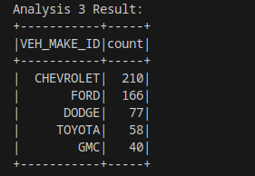

# BCG-Case-study

This case study is about car crashes across the US . I will be analysing the
metadata in detail to understand any information possible.

## Meta Data Analysis

With the given metadata, 
- for all the join operations , CRASH_ID is a key that can be used.
- Every dataset  given has  has 1048576 rows.
- There is no issue of datatypes mismatch with these datasets.
- All the datasets seem to be clean with no null values .

## Analytical solutions for the given questions

- Analysis 1: Find the number of crashes (accidents) in which number of persons killed are male? : **0**
- Analysis 2: How many two wheelers are booked for crashes? : **167456**
- Analysis 3: Determine the Top 5 Vehicle Makes of the cars present in the crashes in which driver died and Airbags did not deployed
  
  
  
- Analysis 4: Determine number of Vehicles with driver having valid licences involved in hit and run? : **1**
- Analysis 5: Which state has highest number of accidents in which females are not involved?
- Analysis 6: Which are the Top 3rd to 5th VEH_MAKE_IDs that contribute to a largest number of injuries including death
- Analysis 7: For all the body styles involved in crashes, mention the top ethnic user group of each unique body style
- Analysis 8: Among the crashed cars, what are the Top 5 Zip Codes with highest number crashes with alcohols as the contributing factor to a crash (Use Driver Zip Code)
- Analysis 9: Count of Distinct Crash IDs where No Damaged Property was observed and Damage Level (VEH_DMAG_SCL~) is above 4 and car avails Insurance : **2**
- Analysis 10: Determine the Top 5 Vehicle Makes where drivers are charged with speeding related offences, has licensed Drivers, used top 10 used vehicle colours and has car licensed with the Top 25 states with highest number of offences (to be deduced from the data)

## MetaData

### Table	Charges

CRASH_ID-Crash ID – System-generated unique identifying number for a crash

UNIT_NBR-The unit of the person who was charged

PRSN_NBR-The person who was charged

CHARGE-Charge

CITATION_NBR-Citation/Reference Number

### Table	Endorsements

CRASH_ID -	Crash ID – System-generated unique identifying number for a crash

UNIT_NBR -	The unit of the person who was charged

DRVR_LIC_ENDORS_ID -	Commercial Driver License Endorsements

### Table	Restrict

CRASH_ID -Crash ID – System-generated unique identifying number for a crash

UNIT_NBR -	The unit of the person who was charged

DRVR_LIC_RESTRIC_ID	- Driver License Restrictions

### Table	Primary Person

CRASH_ID -	Crash ID – System-generated unique identifying number for a crash  

UNIT_NBR	- Unit number entered on crash report for a unit involved in the crash

PRSN_NBR -	Person number captured on the crash report

PRSN_TYPE_ID -	Person Type

PRSN_OCCPNT_POS_ID -	The physical location of an occupant in, on, or outside of the motor vehicle prior to the First Harmful Event or loss of control

PRSN_INJRY_SEV_ID	 - Severity of injury to the occupant

PRSN_AGE	- Age of person involved in the crash

PRSN_GNDR_ID -	Gender of person involved in the crash

PRSN_EJCT_ID -	The extent to which the person's body was expelled from the vehicle during any part of the crash

PRSN_REST_ID -	The type of restraint used by each occupant

PRSN_AIRBAG_ID -	Indicates whether a person's airbag deployed during the crash and in what manner

PRSN_HELMET_ID -	Indicates if a helmet was worn at the time of the crash

PRSN_SOL_FL -	Solicitation flag

PRSN_ALC_SPEC_TYPE_ID -	Type of alcohol specimen taken for analysis from the primary persons involved in the crash

PRSN_ALC_RSLT_ID -	Alcohol Result

PRSN_BAC_TEST_RSLT -	Numeric blood alcohol content test result for a primary person involved in the crash, using standardized alcohol breath results (i.e. .08 or .129)

PRSN_DRG_SPEC_TYPE_ID -	Type of drug specimen taken for analysis from the primary persons involved in the crash

PRSN_DRG_RSLT_ID -	Primary person drug test result

DRVR_DRG_CAT_1_ID -	First category of drugs related to the driver

PRSN_DEATH_TIME -	Primary person's time of death.

INCAP_INJRY_CNT -	Suspected Serious Injury Count

NONINCAP_INJRY_CNT -	Non-incapacitating Injury Count

POSS_INJRY_CNT -	Possible Injury Count

NON_INJRY_CNT -	Not Injured Count

UNKN_INJRY_CNT -	Unknown Injury Count

TOT_INJRY_CNT -	Total Injury Count

DEATH_CNT -	Death Count

DRVR_LIC_TYPE_ID -	Driver's license type

DRVR_LIC_STATE_ID -	The state or province that issued the vehicle driver's license or identification card

DRVR_LIC_CLS_ID -	Driver's license clas

DRVR_ZIP -	Driver's address - zip code

### Table	Unit 

CRASH_ID -	Crash ID – System-generated unique identifying number for a crash

UNIT_NBR -	Unit number entered on crash report for a unit involved in the crash

UNIT_DESC_ID -	Unit Description  - Describes the type of unit

VEH_PARKED_FL -	Parked Vehicle

VEH_HNR_FL -	Hit and Run

VEH_LIC_STATE_ID -	License Plate State

VIN	VIN

VEH_MOD_YEAR -	4–digit numeric model year of the vehicle as designated by the manufacturer

VEH_COLOR_ID -	Vehicle Color

VEH_MAKE_ID -	The vehicle manufacturer’s distinctive name applied to a group of motor vehicles (Ford, Chevrolet, etc.)

VEH_MOD_ID -	The vehicle manufacturer’s trade name

VEH_BODY_STYL_ID -	The body style of the vehicle involved in the crash

EMER_RESPNDR_FL -	Indicates if a peace officer, firefighter, or emergency medical services employee is involved in a crash while driving a law enforcement vehicle, fire department vehicle, or medical emergency services vehicle while on emergency

OWNR_ZIP -	Owner Address, Zip

FIN_RESP_PROOF_ID -	Indicates whether the vehicle driver presented satisfactory evidence of financial responsibility

FIN_RESP_TYPE_ID -	Financial Responsibility Type

VEH_DMAG_AREA_1_ID -	Vehicle Damage Rating 1 - Area

VEH_DMAG_SCL_1_ID -	Vehicle Damage Rating 1 - Severity

FORCE_DIR_1_ID -	Vehicle Damage Rating 1 - Direction of Force

VEH_DMAG_AREA_2_ID -	Vehicle Damage Rating 2 - Area

VEH_DMAG_SCL_2_ID -	Vehicle Damage Rating 2 - Severity

FORCE_DIR_2_ID -	Vehicle Damage Rating 1 - Direction of Forc

VEH_INVENTORIED_FL -	Vehicle Inventoried

VEH_TRANSP_NAME -	Towed By

VEH_TRANSP_DEST -	Towed To

CONTRIB_FACTR_1_ID -	The first factor for the vehicle  which the officer felt contributed to the crash

CONTRIB_FACTR_2_ID -	The second factor for the vehicle  which the officer felt contributed to the crash

CONTRIB_FACTR_P1_ID -	The first factor for the vehicle  which the officer felt contributed to the crash

VEH_TRVL_DIR_ID -	Cardinal direction that the vehicle was traveling prior to the First Harmful Event or loss of control

FIRST_HARM_EVT_INV_ID	IF- Indicate First Harmful Event Involvement

INCAP_INJRY_CNT -	Suspected Serious Injury Count

NONINCAP_INJRY_CNT -	Non-incapacitating Injury Count

POSS_INJRY_CNT -	Possible Injury Count

NON_INJRY_CNT -	Not Injured Count

UNKN_INJRY_CNT -	Unknown Injury Count

TOT_INJRY_CNT -	Total Injury Count

DEATH_CNT -	Death Count

